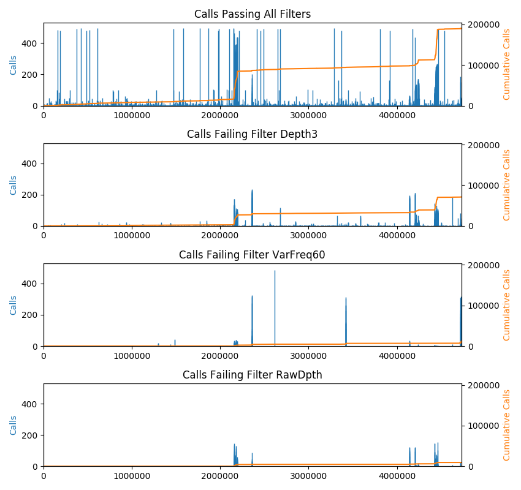

========
Usage
========

.. highlight:: bash

Narrow
------
Some VCF files can be very wide and difficult to view with genotypes for many samples.
Using VCF Toolz, you can reformat the data into a tall and narrow format for easier viewing
and to facilitate automated diff of files.  This is not a standard file format.  Output is
written to stdout.

To reformat the data in narrow format::

    vcftoolz narrow file.vcf > narrow.tsv

The resulting file looks like this::

  Sample       CHROM       POS      REF  ALT  GT  SDP  RD   AD  RDF  RDR  ADF  ADR  FT
  CFSAN000189  CP006053.1  115714   C    T    0   102  102  0   49   53   0    0    PASS
  CFSAN000191  CP006053.1  115714   C    T    0   59   59   0   37   22   0    0    PASS
  CFSAN000211  CP006053.1  115714   C    T    0   64   64   0   30   34   0    0    PASS
  CFSAN000661  CP006053.1  115714   C    T    1   32   0    32  0    0    11   21   PASS
  CFSAN000189  CP006053.1  147186   G    T    0   105  105  0   63   42   0    0    PASS
  CFSAN000191  CP006053.1  147186   G    T    1   51   0    51  0    0    35   16   PASS
  CFSAN000211  CP006053.1  147186   G    T    0   51   51   0   28   23   0    0    PASS
  CFSAN000661  CP006053.1  147186   G    T    0   43   43   0   25   18   0    0    PASS
  CFSAN000189  CP006053.1  190695   A    G    0   107  107  0   75   32   0    0    PASS
  CFSAN000191  CP006053.1  190695   A    G    1   38   0    37  0    0    26   11   PASS
  CFSAN000211  CP006053.1  190695   A    G    1   82   0    82  0    0    55   27   PASS
  CFSAN000661  CP006053.1  190695   A    G    0   28   28   0   16   12   0    0    PASS
  CFSAN000189  CP006053.1  1834926  T    .    .   .    .   .   .    .     .    .    .
  CFSAN000191  CP006053.1  1834926  T    .    .   .    .   .   .    .     .    .    .
  CFSAN000211  CP006053.1  1834926  T    .    .   13   0   13  0    0     0    13   Region
  CFSAN000661  CP006053.1  1834926  T    .    .   .    .   .   .    .     .    .    .

By default, all genotype calls are included in the output.  Command line options allow you to
exclude some calls.  To exclude calls matching the reference, missing calls, and filtered calls::

  vcftoolz narrow --exclude_ref --exclude_missing --exclude_filtered file.vcf > narrow.tsv

To see a full list of options for excluding genotype calls::

  vcftoolz narrow --help

Compare
-------
You can find the similarites and differences between VCF files with the ``compare`` command.  It works with
multiple files and multiple samples per file.

To compare VCF files::

  vcftoolz compare file1.vcf file2.vcf file3.vcf > summary.txt

By default, all genotype calls are included in the output.  Command line options allow you to
exclude some calls.  To exclude calls matching the reference, missing calls, and filtered calls::

  vcftoolz compare --exclude_ref --exclude_missing --exclude_filtered file1.vcf file2.vcf file3.vcf > summary.txt

To see a full list of options for excluding genotype calls::

  vcftoolz compare --help

Summary report
~~~~~~~~~~~~~~
A comparison report is written to stdout listing the differences between the VCF files.  The report lists the following:

* Variant positions found only in one of the VCF files
* Sample variants found only in one of the VCF files
* Variant positions missing in each VCF file when found in at least 2 other VCF files
* Sample variants missing in each VCF file when found in at least 2 other VCF files

When run with the ``--truth`` option, the first VCF file is regarded as correct.  The following additional
metrics are generated:

* Number of true positives, false negatives, false positives
* Precision, recall, F1 score
* Number of true negative variants correctly removed by filtering
* Number of false negative variants incorrectly removed by filtering

Venn diagrams
~~~~~~~~~~~~~
When 2 or 3 VCF files are compared, the following Venn diagrams are generated:

* venn2.positions.pdf - Venn diagram of variant positions between all pairs of VCF files
* venn2.snps.pdf - Venn diagram of sample variants between all pairs of VCF files

When 3, 4, 5, or 6 VCF files are compared, one of the following Venn diagrams is generated:

* venn3.pdf - Side by side Venn diagrams of variant positions and sample variants
* venn4.pdf - Side by side Venn diagrams of variant positions and sample variants
* venn5.pdf - Side by side Venn diagrams of variant positions and sample variants
* venn6.pdf - Side by side Venn diagrams of variant positions and sample variants

Tabulated results
~~~~~~~~~~~~~~~~~
A detailed spreadsheet can be generated with the ``--tabulate`` command line option.
The spreadsheet contains one row per position and one column per sample.  The rows are
ordered in such a way that variants found in multiple files are grouped together. In
other words, each section of the Venn diagram will have corresponding rows grouped
together in the spreadsheet.

The spreadsheet looks like this::

  Chrom       Pos      Ref  CFSAN000189  CFSAN000191  CFSAN000211  CFSAN000661
  CP006053.1  115714   C    0            0            0            T-111
  CP006053.1  147186   G    0            T-111        0            0
  CP006053.1  190695   A    0            G-011        G-111        0
  CP006053.1  221363   G    0            0            A-111        0
  CP006053.1  268434   C    0            T-011        T-111        0
  CP006053.1  309014   C    0            T-111        0            0
  CP006053.1  309657   C    0            T-111        0            0
  CP006053.1  388919   A    0            G-111        G-111        0
  CP006053.1  432510   T    0            0            0            G-111

Each cell of the table contains the alternate allele and a string of zeros and ones to indicate which
VCF files contain the variant.  For example:

* 0 indicates none of the VCF files contained a variant at this position for this sample
* G-111 indicates an alternate allele G found in all 3 VCF files specified on the command line.
* T-011 indicates an alternate allele T found in the 2nd and 3rd VCF files specified on the command line.

Count
-----
The count command counts samples, positions, calls, snps, indels, other variants, missing calls, and
filter reasons, while allowing you to restrict which calls are eligible for counting.

To count metrics in the VCF file::

    vcftoolz count file.vcf

Output is written to stdout::

      3 samples
    282 positions
    846 calls
      0 heterozygous calls
    846 homozygous calls
    194 reference calls
    194 snp calls
      0 indel calls
      0 other variant calls
    266 missing calls
    388 calls PASS filter
    192 calls failing any filter
    187 calls failing filter Region
      3 calls failing filter VarFreq60
      1 calls failing filter RawDpth
      1 calls failing filter Depth3

By default, all genotype calls are included in the output.  To count only homozygous snps::

  vcftoolz count --exclude_indels --exclude_vars --exclude_refs --exclude_hetero --exclude_filtered --exclude_missing file.vcf

To see a full list of options for excluding genotype calls::

  vcftoolz count --help

Plot
----
The plot command shows a bar-chart of the locations of calls along the length of the genome. This is intended for VCF
files with multiple samples. The height of the bars indicates the number of samples having calls at each position.
In addition, a cumulative sum of calls is plotted (right axis).  The cumsum line is useful to detect areas of
high-density snps.  By default, every CHROM is included in the plot. The x-axis depicts the genome with contigs
arranged in order from largest to smallest. A command line option lets you plot a single CHROM, which might be useful
to zoom-in on a particular region. The plot command also emits a list of contigs to stdout with the start and end
position of each. If the VCF file contains failed calls, there will be a separate plot depicting the failed calls for
every failure reason found in the VCF file.  Note that some calls can be failed for more than one reason and therefore
some calls will be drawn more than once.

To plot calls::

    vcftoolz plot --exclude_refs --exclude_missing file.vcf reference.fasta image.png

By default, all genotype calls are included in the output.  Command line options allow you to exclude some calls.
The plot command displays additional useful information when it finds filtered calls.  For that reason, excluding
filtered calls is not recommended.

To see a full list of options for excluding genotype calls::

  vcftoolz plot --help

